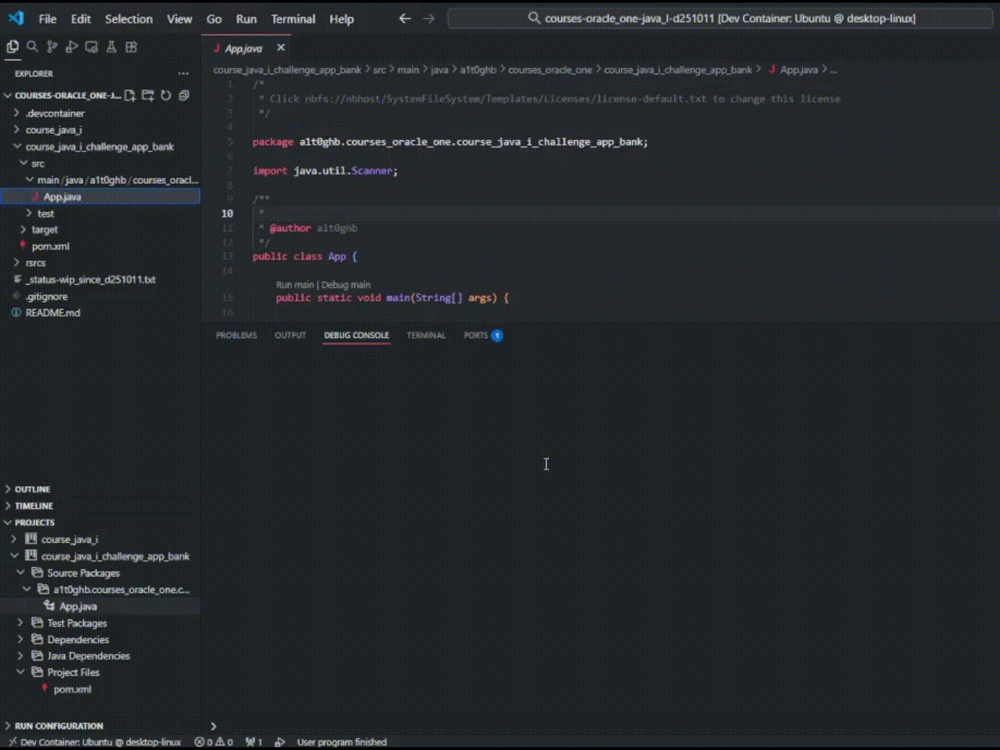
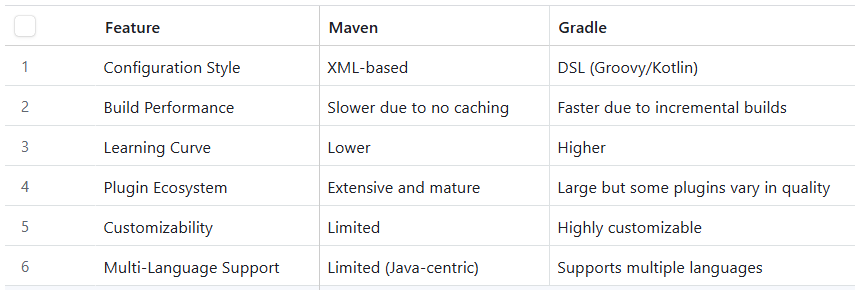
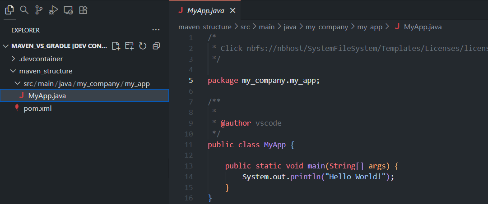
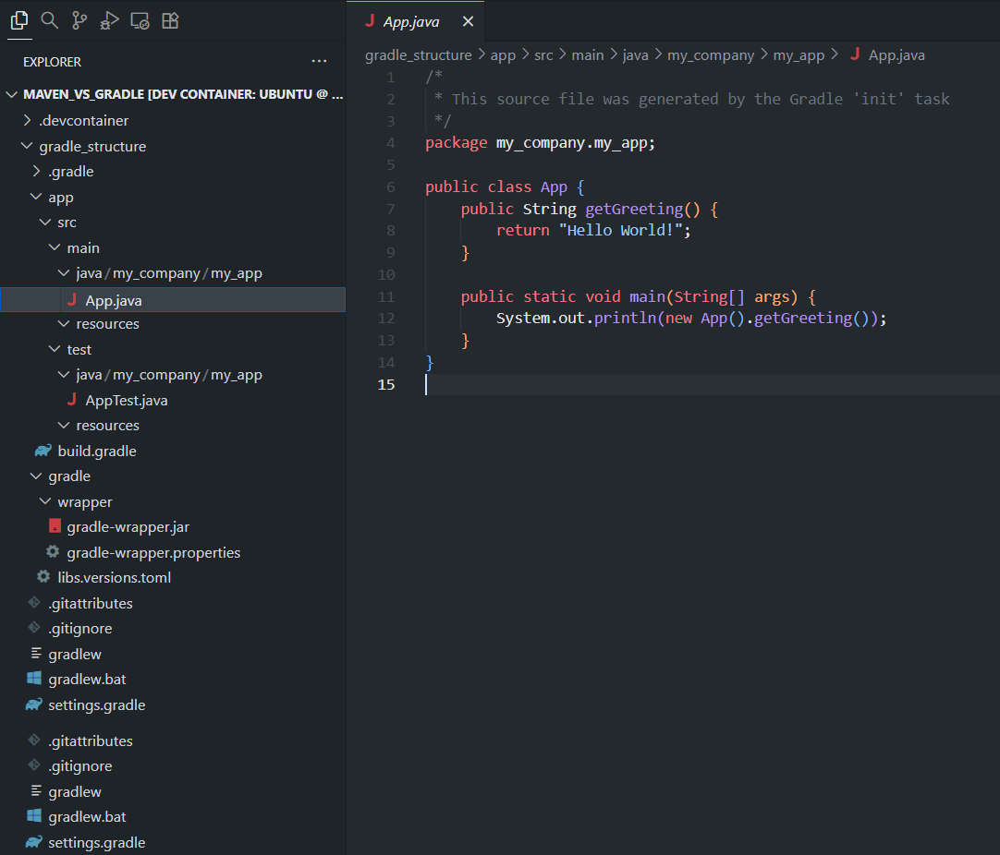
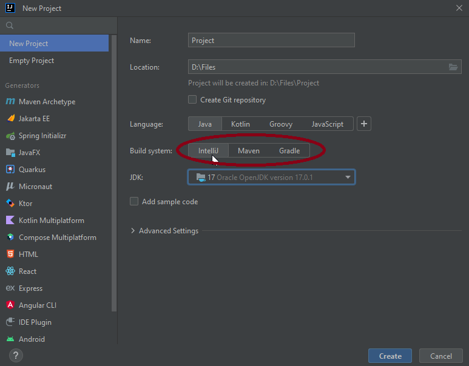
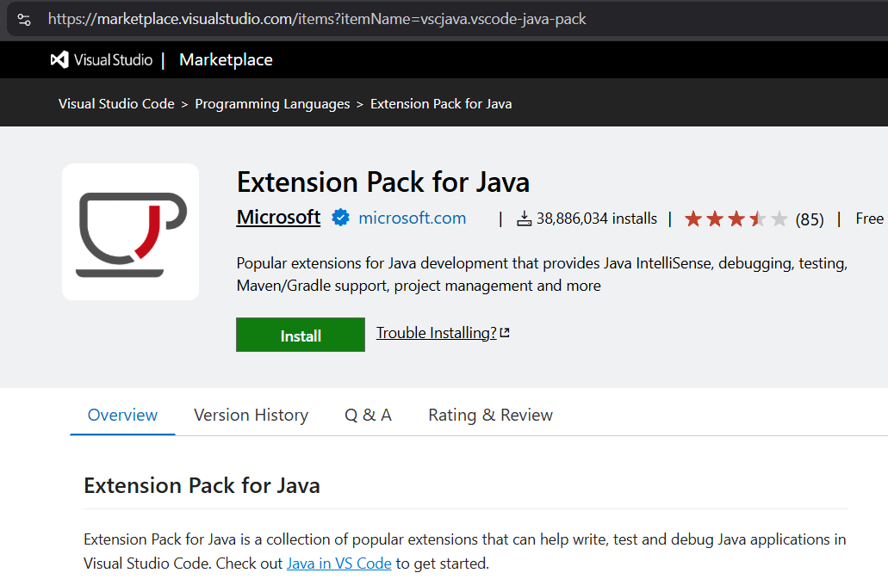
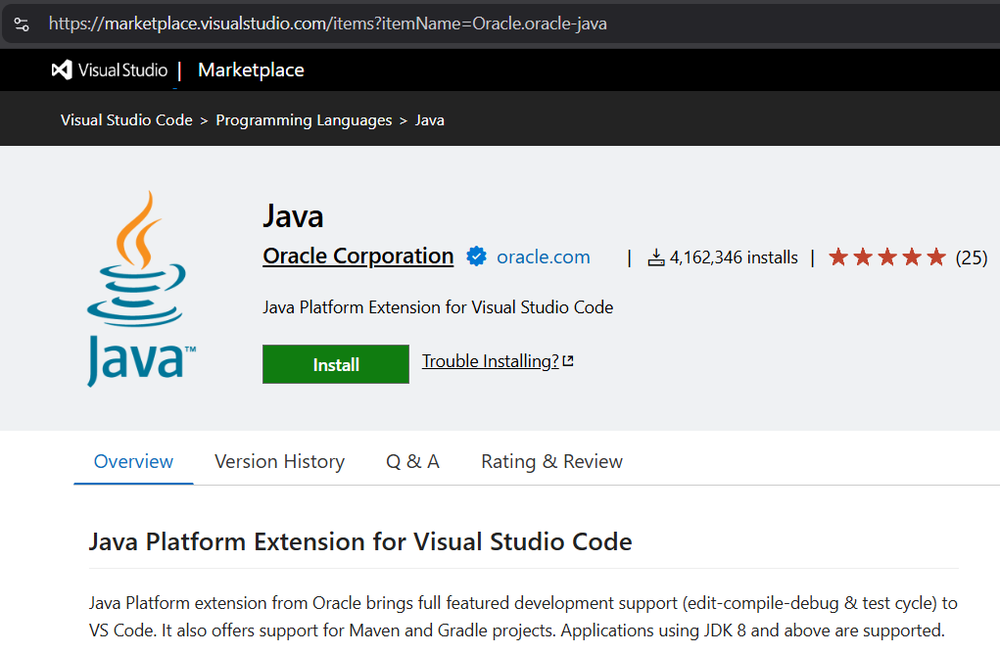

<!-- Badges:
- Source: 'https://shields.io/docs/static-badges', 'https://shields.io/badges/static-badge'.
- HTML structure followed: 'https://github.com/facebook/docusaurus/blob/main/README.md?plain=1'.
- Badges with logos: 'https://shields.io/docs/logos', 'https://simpleicons.org/', 'https://github.com/simple-icons/simple-icons/blob/master/slugs.md'.
- HTML <a> tag not redirecting: 'https://stackoverflow.com/questions/8260546/make-a-html-link-that-does-nothing-literally-nothing/8260561#8260561', 'https://www.geeksforgeeks.org/html/how-to-create-html-link-that-does-not-follow-the-link/'.
-->

<!-- Badge: WIP

  

 -->
<!--
🚧 WIP: section under construction. 🚧
-->

<!-- Badge: Done -->

  

<!-- README structure followed:
- 'https://www.aluracursos.com/blog/como-escribir-un-readme-increible-en-tu-github/'.
- 'https://github.com/camilafernanda/GlicoCare/'.
- 'https://github.com/nasa/openmct/'.
- 'https://github.com/facebook/docusaurus'.
-->

# Basics of Java (I).

<!--

  🌐 '<a href="[URL]">[URL]</a>'

 -->

 <!--
Enable autoplay of animated images:
- 'https://stackoverflow.com/questions/72508378/enable-gif-autoplay-on-github-readme/72509078#72509078'.
- 'https://github.com/orgs/community/discussions/47709'.
- 'https://github.com/settings/accessibility'.
Image width for GitHub READMEs:
- 'https://github.com/orgs/community/discussions/42424'.
- 'https://gist.github.com/uupaa/f77d2bcf4dc7a294d109'.
-->
<!-- 

    

 -->

    

Final delivery of the 1st course: '[Java: creando tu primera aplicación](https://app.aluracursos.com/course/java-creando-primera-aplicacion)', from module (a.k.a. 'formación' in spanish) '[Java Orientado a Objetos G9 - ONE](https://app.aluracursos.com/formacion-java-grupo9-one)', of [Alura LATAM](https://www.aluracursos.com/). <b>Part of [ORACLE Next Education (ONE)](https://www.oracle.com/co/education/oracle-next-education/) education program, in LATAM</b>.

Unlike previous courses, this final delivery consists of 2 projects, each one in it's own folder (using folders structure of [Maven's java build automation tool](./README.md#choosing-a-java-automation-tool-for-builds-maven-vs-gradle-vs-intellijs-buitl-in-tool)):

- Course exercise; in folder: [`course_java_i`](./course_java_i).
- Course challenge of a bank app; in folder: [`course_java_i_challenge_app_bank`](./course_java_i_challenge_app_bank).

<!-- Callouts:
- Improved format taken from examples in 'https://github.com/nasa/openmct/blob/master/README.md?plain=1'.
-->
> [!NOTE]
> This README is **mainly** written in english (en), but it might have some sections in spanish (sp), since course content is in spanish.

# ℹ About.

The course covered topics such as:

- What's [JDK (Java Development Kit) vs. JRE (Java Runtime Environment) and uses](https://www.digitalocean.com/community/tutorials/difference-jdk-vs-jre-vs-jvm); e.g. development vs. consumer use.
- [Oracle JDK vs. OpenJDK](https://www.redhat.com/en/topics/application-modernization/openjdk-vs-oracle-jdk), and how to install it.
- What's [JVM (Java Virtual Machine), how to compile `.java` files, *bytecodes*, and how to run `.class` files using `javac`, `java` and `javap` commands](https://www.aluracursos.com/blog/paso-a-paso-jvm).
- Recommended IDE (Integrated Development Enviroment) for Java: ['IntelliJ, from Jetbrains'](https://www.jetbrains.com/idea/download/download-thanks.html?platform=windows&code=IIC).
    - Other alternatives: [VS Code with Java extensions](./README.md#choosing-a-java-build-automation-tool-in-vs-code).
- **[Own research]** [Java build automation tools 'Maven' vs. 'Gradle' (vs. IntelliJ's buitl-in tool)](./README.md#choosing-a-java-automation-tool-for-builds-maven-vs-gradle-vs-intellijs-buitl-in-tool).
- Java concepts and structures:
    - Operators: to assign, arithmetic, comparison, and logical.
    - Conventions for writing code, such as Camel Case.
    - Primitive data types: `boolean`, `byte`, `char`, `short`, `int`, `long`, `float` and `double`.
    - Strings and text blocks.
    - Data type casting.
    - Flow controls and loops: `if-else`, `switch`, `for`, and `while`.

## 🥇 Course Certificate of Completion.

Available at '<https://app.aluracursos.com/certificate/68e11bba-d232-4d25-892c-c54e6c05011d>'.

- Estimated workload: 8h.
- Activities: 49.
- Topics:
    1. 'El primer programa en Java'.
    2. 'Construyendo el catálogo de películas'.
    3. 'Controlando el flujo de la aplicación'.
    4. 'Consolidando conocimientos'.

## 🔗 Links to program resources.

**PROGRAM STRUCTURE.**

- <b>*[Course]* 'Java: creando tu primera aplicación'</b>: '<https://app.aluracursos.com/course/java-creando-primera-aplicacion/>'.
- *[Module]* 'Java Orientado a Objetos G9 - ONE': '<https://app.aluracursos.com/formacion-java-grupo9-one/>'.
- **ORACLE Next Education (ONE) education program, in LATAM**: '<https://www.oracle.com/co/education/oracle-next-education/>'.
- Alura LATAM education platform: '<https://www.aluracursos.com/>'.

**COURSE RESOURCES.**

- GitHub's project repository: '<https://github.com/alura-cursos/2023-Java-creando-tu-primera-aplicacion/>'.
    - Branch for course exercises: `aula-1` to `aula-3`. Ref.: '<https://github.com/alura-cursos/2023-Java-creando-tu-primera-aplicacion/tree/aula-1>'.
    - Branch for course challenge: `aula-4-deasafioFinal`. Ref.: '<https://github.com/alura-cursos/2023-Java-creando-tu-primera-aplicacion/tree/aula-4-desafioFinal>'.

# 🐾 Notes About Project.

> [!NOTE]
> This section is only for reference, for documentation purposes in case of re-visiting course notes.

## Choosing a Java Automation Tool for Builds: 'Maven' vs. 'Gradle' (vs. IntelliJ's buitl-in tool).

> [!NOTE]
> TLDR; Maven was choosen for this project, due to its 'simplicity' and 'convenience' for smaller projects.

Virtually all editors with capabilities for Java development 'forces' you to use a build automation tool between '[Maven](https://maven.apache.org/)' and '[Gradle](https://gradle.org/)' ([Jetbrains' IDE IntelliJ editor](https://www.jetbrains.com/idea/) has it's own, propietary editor's built-in build tool, although it's never recommended to use a propietary solution; [instead use a market proven and widely adopted tool, in this case for CI such as 'Maven' or 'Gradle'](https://www.reddit.com/r/Kotlin/comments/uxmi8y/comment/i9yoiqc/)). **These tools are crucial for builds since they manage dependencies, compiling code, packaging projects, and automating testing.**

**IntelliJ vs. Maven vs. Gradle: '<https://stackoverflow.com/questions/57470933/difference-between-intellij-maven-and-gradle-build-system-in-intellij-ide/57472962#57472962>'**.

- IntelliJ's built-in tool is 'plain vanilla'; only compiles files in the project.
- 'Maven' and 'Gradle' allow for custom (and more complex, if required) build configuration.
- Maven's `pom.xml` main file defines **lifecycle goals**, while gradle's `build.gradle` defines **tasks**.

**IntelliJ vs. Maven vs. Gradle: '<https://www.reddit.com/r/Kotlin/comments/uxmi8y/comment/i9yoiqc/>'**.

- It's **NOT RECOMMENDED** to use an editor's built-in tool such as one from 'IntelliJ'; *instead use a market proven and widely adopted tool, in this case for CI such as Maven or Gradle*.
- 'Gradle' in general is *'better'* than 'Maven'; faster for incremental builds and allows more complexity, customization and plugins, but it comes at a **cost**: *stepper learning curve and more files to keep track of*.
    - **Go with 'Gradle' for large, multi-module projects, and 'Maven' for smaller projects that don't need customization or many plugins.**
    - Although. for Android, **AVOID USING GRADLE** and instead use 'Maven'. Although 'Maven' is *in general slower* than 'Gradle', for 'Android' the concensus is that 'Maven' is better (and not heard of being 'slow').

**Maven vs. Gradle: '<https://medium.com/@ahmettemelkundupoglu/maven-vs-gradle-a-detailed-comparison-of-pros-and-cons-with-examples-594ba33cc57f>'**.

    

In terms of project structure, '**Maven**' is 'simpler' (at least for smaller projects), which can be seen in following example; for starting / blank project:

- **Base / Initial / Blank project**.
- *Same parameters*: project's package name (i.e. '`groupId`' + '`artifactId`' in 'dot notation') = '`my_company.my_app`'.

    <table style="border:none;">
        <tr>
            <td style="text-align:center; vertical-align:top">
                
                
Maven's project structure, for starting / blank project.

            </td>
            <td style="text-align:center; vertical-align:top">
                
                
Gradle's project structure, for starting / blank project.

            </td>
        </tr>
    </table>

### Choosing a Java build automation tool in IntelliJ.

In 'IntelliJ', you choose a Java build automation tool when creating a new project, in it's creation window:

    

### Choosing a Java build automation tool in VS Code.

In VS Code, you can start creating files and classes withouth choosing a Java build automation tool, but it's **RECOMMENDED to start your project by 'choosing' one since the very beginning**. For this, you need to use a **VS Code extension**.

The 'default' recommended extension is the ['Extension Pack for Java', by Microsoft](https://marketplace.visualstudio.com/items?itemName=vscjava.vscode-java-pack), which is featured in the [Java tutorial of VS Code](https://code.visualstudio.com/docs/java/java-tutorial), but I personally chose the ['Java' extension, by Oracle](https://marketplace.visualstudio.com/items?itemName=Oracle.oracle-java), which is better rated and comes from the corporation that 'maintains' Java.

    <table style="border:none;">
        <tr>
            <td style="text-align:center; vertical-align:top">
                
                
'Extension Pack for Java', by Microsoft ❌.

            </td>
            <td style="text-align:center; vertical-align:top">
                
                
'Java' extension, by Oracle ✅.

            </td>
        </tr>
    </table>

After installing the VS Code extension, to start using it, simply follow notes on its documentation:

- Simply create a new Java class with public static void main(String[] args) method.
- Use the **'Java: New File from Template...'** command to create a new Java file.
- Use the **'Java: New Project...'** command to create a new project.
- Open the folder with existing **Maven** or **Gradle** project files (*pom.xml* or *build.gradle*, *gradle.properties*).

> [!NOTE]
> Please refer to the [beggining of this section](#choosing-a-java-automation-tool-for-builds-maven-vs-gradle-vs-intellijs-buitl-in-tool), to review the differences between '**Maven**' and '**Gradle**'; their recommended use cases and structure.

<!-- Embed dynamic content (image) of contributors:
- 'https://dev.to/lacolaco/introducing-contributors-img-keep-contributors-in-readme-md-gci'.
- 'https://contrib.rocks/'.
-->
# 🤝 Contributors.

Made with [contrib.rocks](https://contrib.rocks).

<!-- Authors table structure
- From repo: 'https://github.com/camilafernanda/GlicoCare/blob/main/README.md?plain=1'.
-->
# 📜 Authors.

| [ a1t0ghb](https://github.com/a1t0ghb) |
| :---: |
<!-- EOF. -->